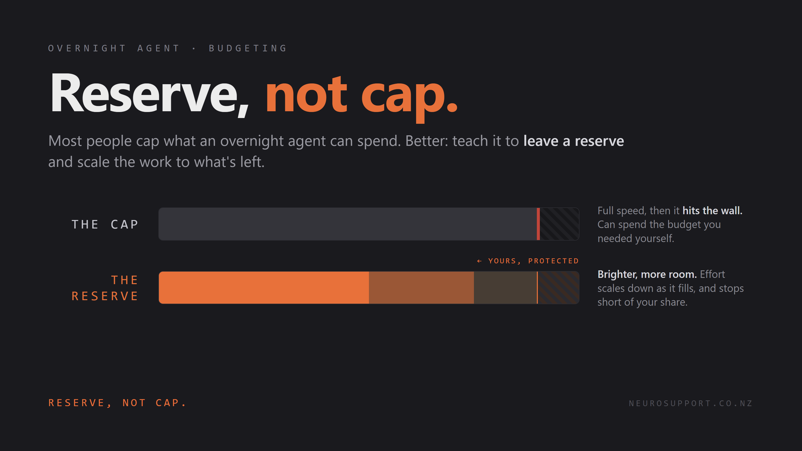
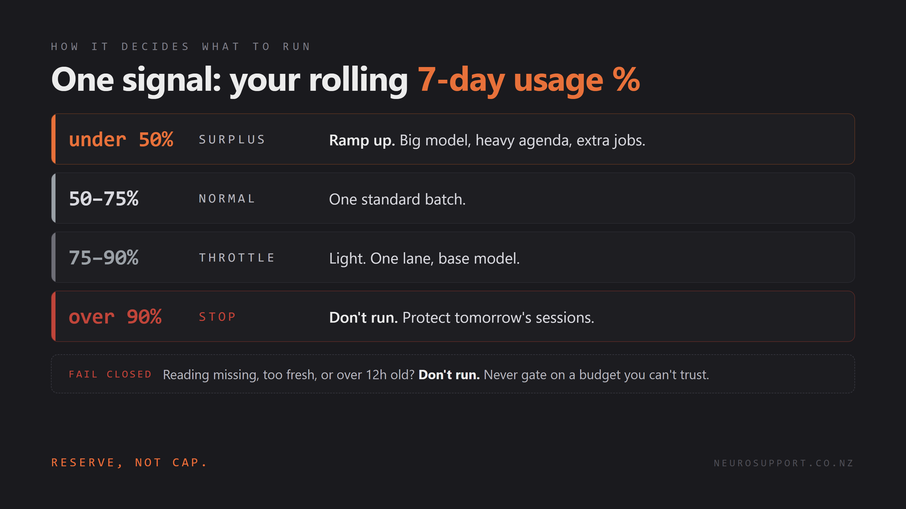

# Nightcap

**Not a cap. A nightcap.**

Your overnight coding agent, on a self-governing budget. It runs heavy when you've got Claude usage to spare and backs off before it starves your own sessions, so you wake up to finished work, not a maxed-out account.



## In plain English

Think of an overnight agent as a little robot that works while you sleep. It runs on a battery: your weekly Claude usage. The catch is that you and the robot share that battery, and it only refills slowly. If the robot drains it overnight, there's none left for you in the morning.

Nightcap is the rule you give the robot before bed. Check the battery first. Full? Do the big jobs. Getting low? Just a little. Almost empty? Don't run, leave it for me.

## The idea

Most people stop an overnight agent from overspending with a hard cap: a kill switch that fires when the bill or the token count crosses a line. A cap is binary. The agent runs flat out until it slams the ceiling, and it will happily burn the budget you needed for your own work the next day.

Nightcap is the opposite. It reads one number, your rolling 7-day Claude usage, and scales the night's work to how much is left. Plenty of headroom, run heavy. Getting tight, throttle. Near the limit, don't run at all. Reserve, not cap.

## How it decides



| Weekly usage | Band | What runs |
|---|---|---|
| under 50% | surplus | Ramp up: big model, heavy agenda, extra jobs |
| 50 to 75% | normal | One standard batch |
| 75 to 90% | throttle | Light: one lane, base model |
| over 90% | stop | Nothing. Protect tomorrow's sessions |

If the reading is missing, too fresh (you're still working), or more than 12 hours old, Nightcap **fails closed** and does not run. It never gates on a budget it can't trust.

## The catch, and the workaround

There's no first-class way to read your own subscription usage from a script yet. It's an open request on the Claude Code repo: [anthropics/claude-code#13585](https://github.com/anthropics/claude-code/issues/13585).

So Nightcap reads the number your **status line** already receives. Claude Code pipes the status-line JSON (which includes `rate_limits` for Pro and Max) to your status-line command on every render. `statusline.js` writes that to a small snapshot file; the controller reads the snapshot. No API, no scraping a UI.

## Who this is for

Nightcap is a governor for an overnight agent you are *already running*. If you don't yet have an unattended nightly Claude or Codex job, this is a solution to a problem you don't have yet. It's a power-user add-on, not a starter project: comfortable-in-the-terminal territory, not beginner.

**You'll need:**

- **Node**, to run the snapshot writer (`statusline.js`).
- To paste one line into `~/.claude/settings.json` (the status-line command).
- A scheduler for the nightly run: **cron** on macOS and Linux, **Task Scheduler** on Windows.
- An overnight agent already set up, for Nightcap to govern.

## Use it

**1. Write the snapshot.** Point your Claude Code status line at `statusline.js` in `~/.claude/settings.json`:

```json
{ "statusLine": { "type": "command", "command": "node /path/to/statusline.js" } }
```

It prints your live `5h | wk` usage in the terminal and writes `~/.claude/usage-snapshot.json` on every render.

**2. Ask Nightcap what to run**, from your overnight launcher or cron:

```bash
python3 nightcap.py      # -> "run: surplus band, big model"   (or "skip: ...")
```
```powershell
./nightcap.ps1           # same, on Windows
```

**3. Branch on the answer.** Launch your agent with the band and model it returns, or stand down if it says `skip`.

Every threshold is a parameter or env var (`SURPLUS_BELOW`, `THROTTLE_ABOVE`, `CEILING`, `STALE_MAX_H`, `STALE_MIN`). Defaults match the table above.

## Keeping it fed (unattended)

The catch above has a sting: the snapshot only refreshes when the status line renders in a real terminal session. Leave the machine alone and it goes stale, and Nightcap fails closed and skips. Fine when you're at the keyboard; useless for an unattended overnight run.

`scheduled-refresh.py` is the fix, and it's the cursed bit. It drives a throwaway interactive Claude session in a hidden pseudo-terminal, sends one harmless message to force a status-line render that carries the live usage, waits until the snapshot's weekly % refreshes to a real value, then quits. About 30 seconds, nothing on screen. It only counts success on a non-null weekly %, so a bare render with no budget data won't fool it.

Schedule it shortly before your run window (fresh, but old enough to clear any "you're still active" guard). Windows Task Scheduler, daily 23:50:

```powershell
$py = (Get-Command python).Source
schtasks /Create /TN "NightcapRefresh" /SC DAILY /ST 23:50 /F /TR "`"$py`" `"C:\path\to\scheduled-refresh.py`""
```

cron, on macOS/Linux:

```
50 23 * * * /usr/bin/python3 /path/to/scheduled-refresh.py
```

If the machine sleeps, also tick "Wake the computer to run this task" (Task Scheduler → Conditions). Needs `statusline.js` active in your Claude settings, Claude logged in, and on Windows `pip install pywinpty`. **The Windows path is verified; the Unix path is best-effort and unconfirmed** (a good contribution if you run macOS or Linux). Either way Nightcap fails closed, so a refresh that doesn't fire just means the next run stands down.

## Beyond Claude Code

The controller doesn't know what Claude is. It reads a snapshot, `{ captured_at, seven_day: { used_percentage } }`, and maps a number to bands. Any agent works once something writes that snapshot. `statusline.js` is just the Claude Code adapter.

**Codex is a clean fit, and in one way easier.** Codex has the same two windows (rolling 5-hour plus weekly, token-based), and unlike Claude it persists the live usage % to local session files: every `token_count` event in `~/.codex/sessions/.../*.jsonl` carries the 5-hour and weekly used %. So a Codex adapter is a small script that reads the latest event and writes the snapshot. No status-line command, no network, no OAuth. [xiangz19/codex-ratelimit](https://github.com/xiangz19/codex-ratelimit) already extracts exactly those numbers with `--json`; an adapter just reshapes them.

For API-billed Codex (dollars, not a subscription %), [ccusage](https://github.com/ryoppippi/ccusage) reads the same session files and reports tokens and cost with `--json`. There, "reserve" means leaving dollars in the budget rather than a slice of a window.

Same caveat as the Claude side: these surfaces are unofficial and can change. There's an open request for a first-class one ([openai/codex#15281](https://github.com/openai/codex/issues/15281), the Codex twin of [claude-code#13585](https://github.com/anthropics/claude-code/issues/13585)). Until one lands, Nightcap's fail-closed gate covers the fragility: if the schema shifts and the snapshot can't be read, it simply doesn't run.

A draft adapter ships at [`adapters/codex-snapshot.py`](adapters/codex-snapshot.py). Run it just before the controller in your overnight job:

```bash
python3 adapters/codex-snapshot.py && python3 nightcap.py
```

It reads the latest session event, maps the two windows by length, and stamps the snapshot with the Codex event's own timestamp so the staleness gate still holds. The parsing is verified against synthetic events but **not yet against a real `~/.codex`**. Best first contribution: run it on a live Codex account and confirm or correct the field paths.

## Why

Nightcap came out of [Neuro Support](https://neurosupport.co.nz), where the whole job is building systems that watch a limit so a person doesn't have to. Same principle, pointed at an agent: a system that watches its own budget so you don't have to.

## License

MIT, 2026 Jamie Robinson
